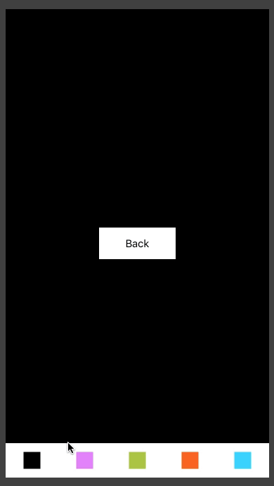
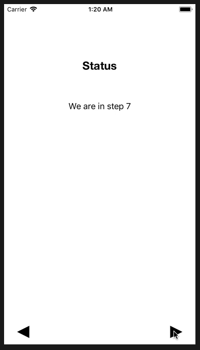

# BoaMenu
Lightweight and easy to use Menu written in Swift 4.  

The main goal of BoaMenu is to offer a simple yet powerful Menu that requires almost no setup and is very easy to use.
This is <b> not a complex </b> Menu and does not include a lot of characteristics that other third-parties Menus have already built.

BoaMenu is great when it comes to <b>simplicity</b> and due to it's generic methods it may be used it as a <b>checkpoint</b> of your own 
Menu; that means that you can build your very own Menu using BoaMenu as a foundation.

So far, BoaMenu supports horizontal menus only.

## Install
1. Download <b>BoaMenu.swift</b> from this repository.
2. Add it to your project.

## Usage
With BoaMenu you have 2 options, you can:
1. Use an already built BoaMenuTemplate.
2. Create a new template using BoaMenuTemplate.

### DefaultMenu - BoaMenuTemplate.
```swift
var menu = BoaMenu.DefaultMenu(target: self)
``` 
The code above will create a white BoaMenu with 5 spaces at the bottom of the view. You can see an example of the <i>DefaultMenu</i> below (consider
that we have not shown how to add images nor events to the buttons).



### StepMenu - BoaMenuTemplate.
Another useful <b>BoaMenuTemplate</b> (and my personal favorite) is <i>StepMenu</i><br><br>
This template builds a white BoaMenu with 5 spaces at the bottom of the view. The first and last space of the menu will be used to show two buttons
(back and next step).
```swift
var menu = BoaMenu.StepMenu(target: self, backImage: UIImage(named:"back-image-name")!, nextImage: UIImage(named:"next-image-name")!)
``` 



