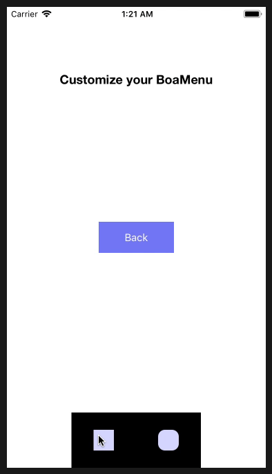
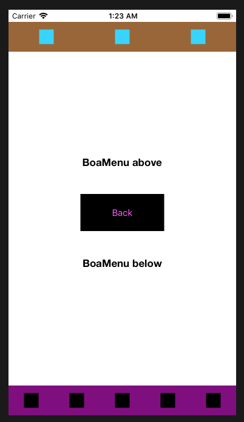
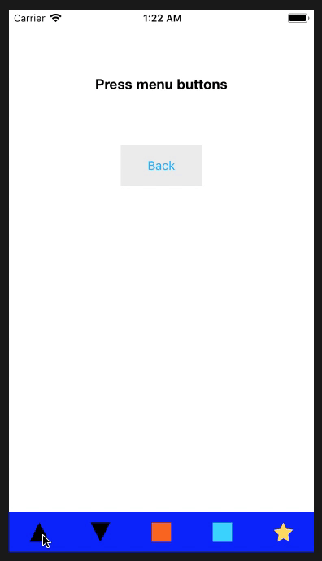

# BoaMenu
Lightweight and easy to use Menu written in Swift 4.  

The main goal of BoaMenu is to offer a simple yet powerful Menu that requires almost no setup and is very easy to use.
This is <b> not a complex </b> Menu and does not include a lot of characteristics that other third-parties Menus have already built.

BoaMenu is great when it comes to <b>simplicity</b> and due to it's generic methods it may be used it as a <b>checkpoint</b> of your own 
Menu; that means that you can build your very own Menu using BoaMenu as a foundation.

So far, BoaMenu supports horizontal menus only.

## Install
1. Download <b>BoaMenu.swift</b> from this repository.
2. Add it to your project.

## Usage
With BoaMenu you have 2 options, you can:
1. Use an already built BoaMenuTemplate.
2. Create a new template using BoaMenuTemplate.

### DefaultMenu (BoaMenuTemplate)
```swift
var menu = BoaMenu.DefaultMenu(target: self)
``` 
The code above will create a white BoaMenu with 5 spaces at the bottom of the view. You can see an example of the <i>DefaultMenu</i> below (consider
that we have not shown how to add images nor events to the buttons).


### StepMenu (BoaMenuTemplate)
Another useful <b>BoaMenuTemplate</b> (and my personal favorite) is <i>StepMenu</i><br><br>
This template builds a white <i>BoaMenu</i> with 5 spaces at the bottom of the view. The first and last space of the menu will be used to show two buttons
(back and next step).
```swift
var menu = BoaMenu.StepMenu(target: self, backImage: UIImage(named:"back-image-name")!, nextImage: UIImage(named:"next-image-name")!)
``` 


### Create a new BoaMenuTemplate
<i>BoaMenuTemplate</i> is basically a struct that will allow you to build a customizable <i>BoaMenu</i>.<br>
The init function of <i>BoaMenuTemplate</i> requests at least 3 parameters. 

```swift
init(frame:CGRect, backgroundColor:UIColor, numberOfButtons:Int)
``` 

The `frame:CGRect` parameter is just the frame of the <i>BoaMenu</i>.<br>
Use `backgroundColor:UIColor` to change the background color of the <i>BoaMenu</i>.<br>
With `numberOfButtons:Int` you tell <i>BoaMenuTemplate</i> how many spaces the <i>BoaMenu</i> should have. 

Here is an example of using a custom <i>BoaMenuTemplate</i> to create a <i>BoaMenu</i>.

```swift
let frame = CGRect(x: (view.frame.size.width/4), y: view.frame.height-80, width: view.frame.size.width/2, height: 80)
let template = BoaMenuTemplate(frame: frame, backgroundColor: .black, numberOfButtons: 2)
let menu = BoaMenu.WithTemplate(template: template, target: self)
``` 



### Create multiple menus
Since <i>BoaMenu</i> is lightweight, there is no problem with adding multiple menus to your view. Just remember to be original and you will find amazing approaches when using it.



### Animations
Remember that <i>BoaMenu</i> is a simple UIView with UIButton(s) inside, so feel free to perform your favorite animation without worrying about the performance of your app.



## Quick Documentation

Add an image to a specific button.
```swift
func setIcon(index i:Int, image:UIImage?)
``` 

Add all the images of all the buttons (from left to right)
```swift
func setIcons(_ imagesNames:[String])
``` 

Add a touchUpInside event to a button
```swift
func setAction(to b:UIButton, selector:Selector)
```

Attach a different UIControlEvent to a button
```swift
func setAction(to b:UIButton, selector:Selector, event:UIControlEvents){
```

<b>Find the rest of the functions in <i>BoaMenu.swift</i> file</b>

## License
[MIT](LICENSE)
